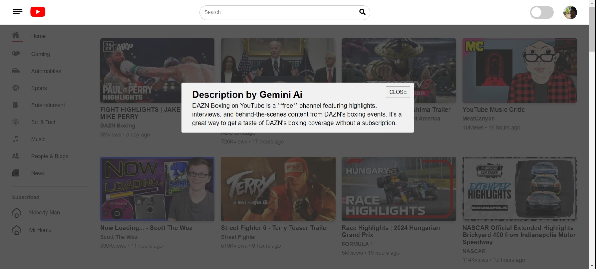
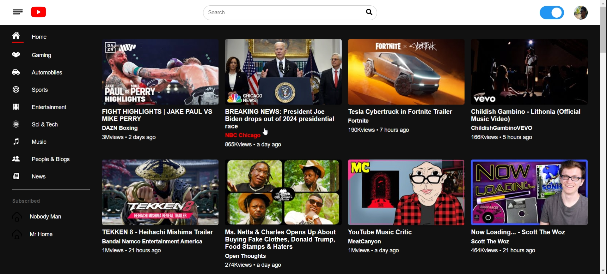
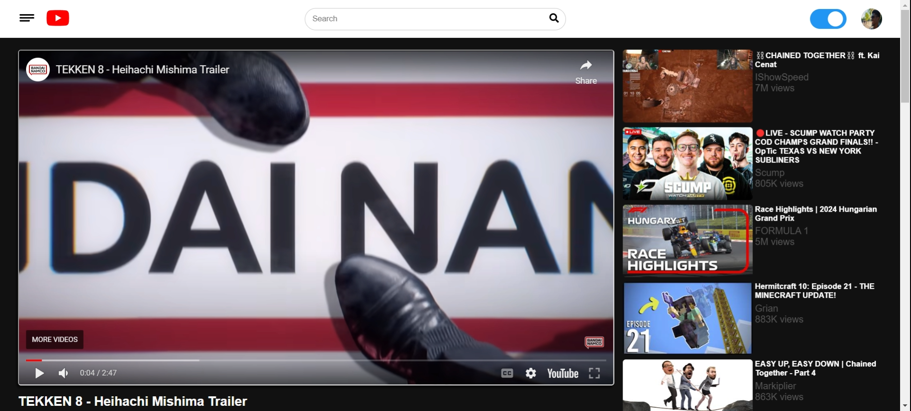

# YouTube Clone with Gemini AI

## Introduction:

YouTube Clone with Gemini AI is a web application that replicates the functionality of YouTube, enhanced with Gemini AI. Users can watch, and interact with videos, while Gemini AI provides channel information, like a mini wikipedia.

## Deployed Site:

-  [Link to deployed site](https://youtube-clone-x-gemini-ai.vercel.app/)

## Github Links:

- [Kevin Kavete](https://github.com/kavetech2023)

## Installation:

To install and run YouTube Clone with Gemini AI locally, follow these steps:

1. Clone the repository to your local machine:
    ```
    git clone https://github.com/kavetech2023/YouTube-Clone.git
    ```

2. Navigate to the project directory:
    ```
    cd youtube-clone-geminiai
    ```

3. Install the dependencies:
    ```
    npm install
    ```

4. Start the development server:
    ```
    npm run dev
    ```

5. Access the application in your browser at http://localhost:3000.

## Usage:

Once the application is running, follow these steps to use YouTube Clone with Gemini AI:

1. Explore videos by searching or browsing through categories.
2. Watch videos.
4. Receive personalized video recommendations.

## Contributing:

Contributions to the YouTube Clone with Gemini AI project are welcome! To contribute, follow these steps:

1. Fork the repository.
2. Create a new branch (git checkout -b feature/improvement).
3. Make your changes.
4. Commit your changes (git commit -am 'Add new feature').
5. Push to the branch (git push origin feature/improvement).
6. Create a new Pull Request.

## App Screenshots:







